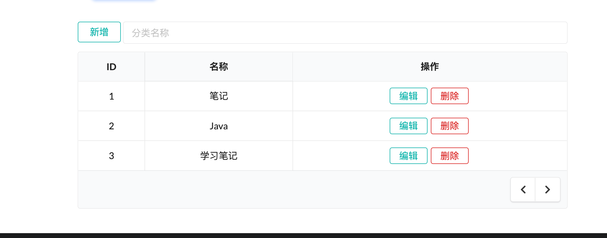
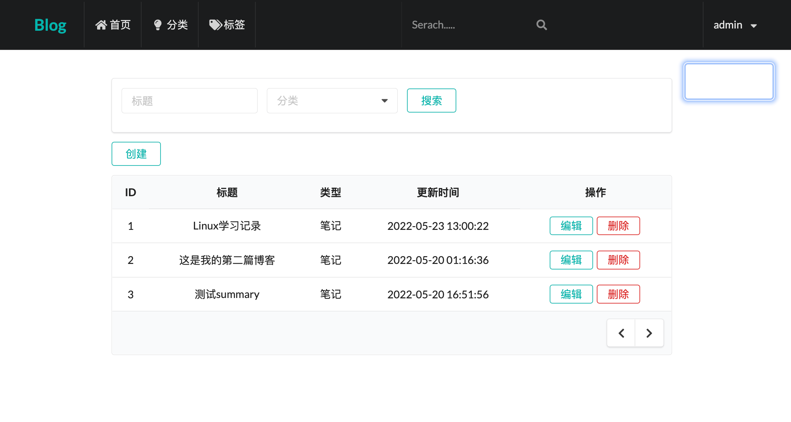
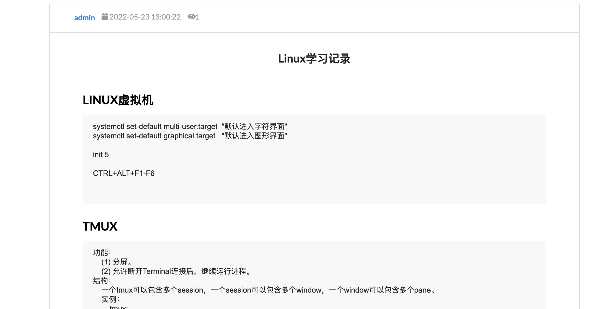
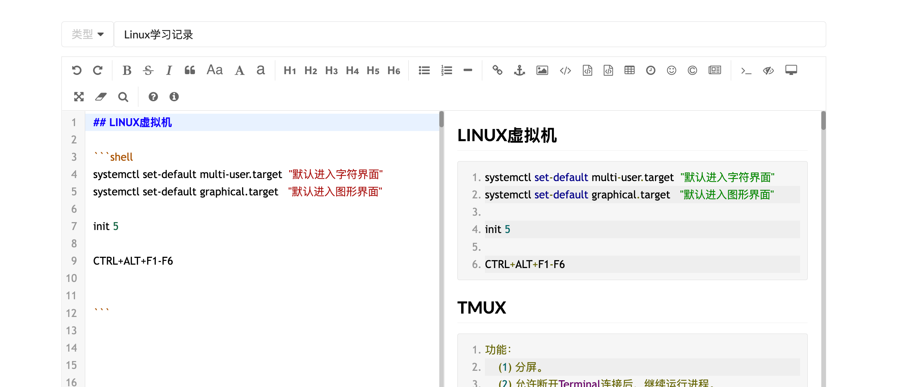
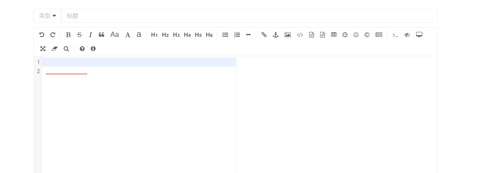
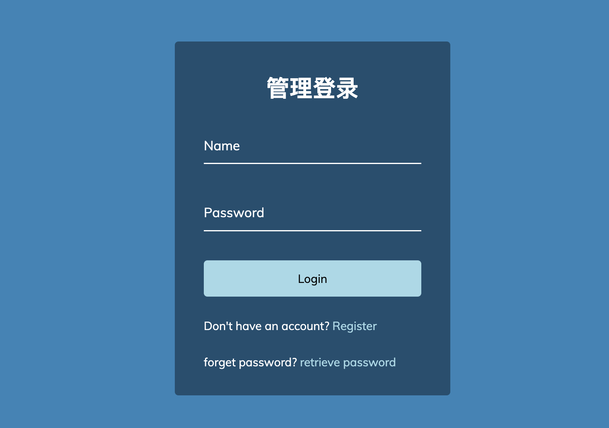
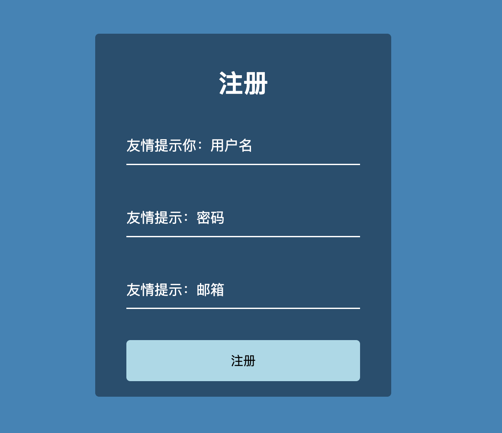
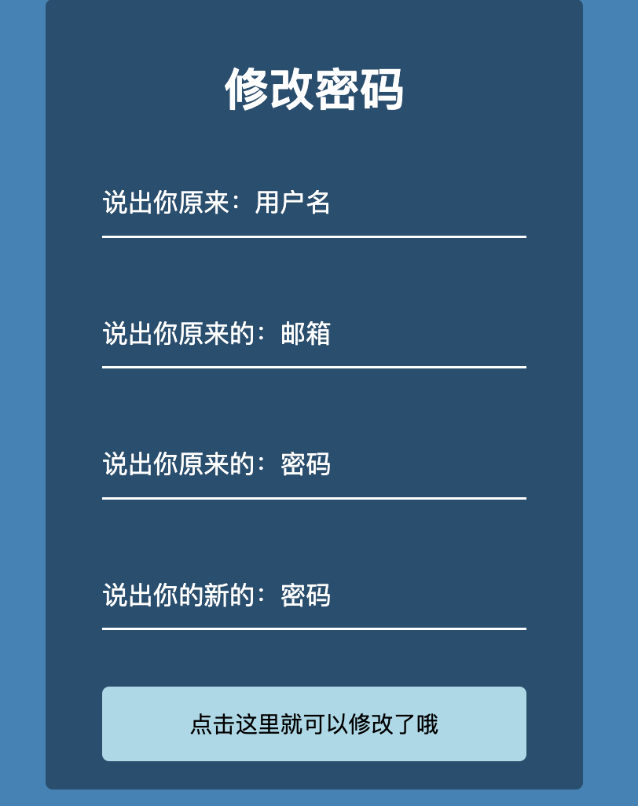
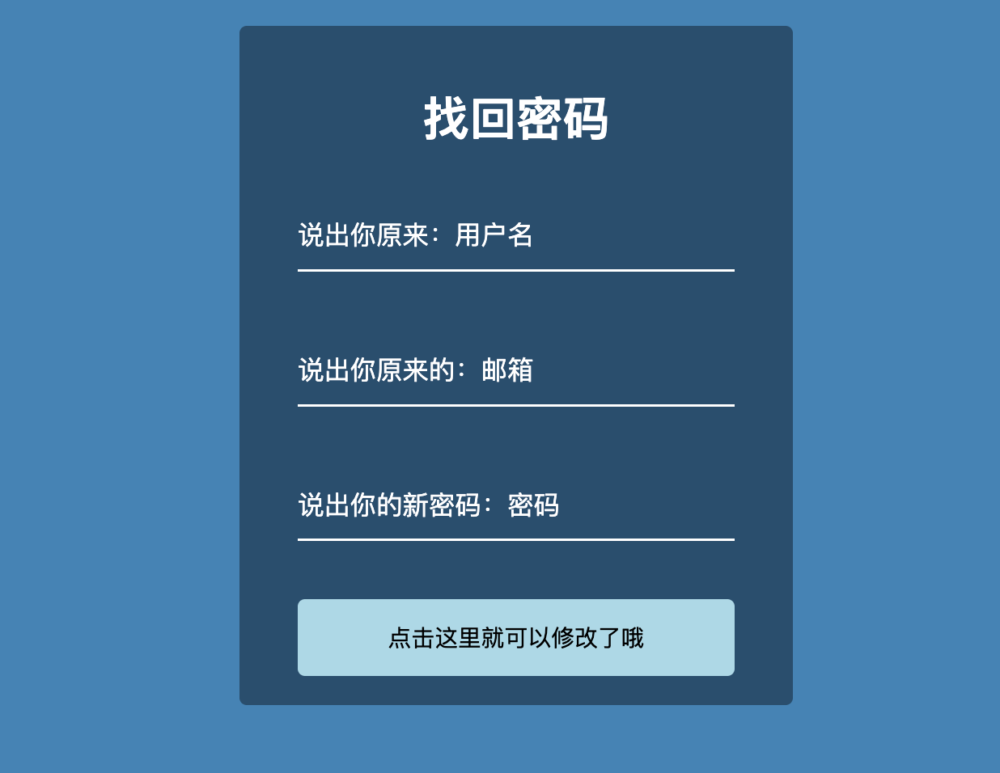

# blog项目说明书


提交项目包和数据库sql文件


## 运行环境

- IDE：IntelliJ IDEA 2021.1.3 (Ultimate Edition)
- SDK：16
- 渲染：thymeleaf
- 框架：springboot 2.6.7
- jar包管理：maven

### 项目依赖

```xml

<!--    springboot版本-->
    <parent>
        <groupId>org.springframework.boot</groupId>
        <artifactId>spring-boot-starter-parent</artifactId>
        <version>2.6.7</version>
        <relativePath/> <!-- lookup parent from repository -->
    </parent>
    <groupId>com.example</groupId>
    <artifactId>blog</artifactId>
    <version>0.0.1-SNAPSHOT</version>
    <name>blog</name>
    <description>Demo project for Spring Boot</description>
    <properties>
        <java.version>17</java.version>
    </properties>
    <dependencies>
<!--        markdown解析-->
        <dependency>
            <groupId>org.commonmark</groupId>
            <artifactId>commonmark-ext-heading-anchor</artifactId>
            <version>0.18.1</version>
        </dependency>
<!--        markdown解析-->
        <dependency>
            <groupId>org.commonmark</groupId>
            <artifactId>commonmark</artifactId>
            <version>0.18.1</version>
        </dependency>
<!--        markdown解析-->
        <dependency>
            <groupId>org.commonmark</groupId>
            <artifactId>commonmark-ext-gfm-tables</artifactId>
            <version>0.18.1</version>
        </dependency>
<!--        数据源,JdbcTemplate-->
        <dependency>
            <groupId>org.springframework.boot</groupId>
            <artifactId>spring-boot-starter-jdbc</artifactId>
        </dependency>
<!--        thymeleaf渲染-->
        <dependency>
            <groupId>org.springframework.boot</groupId>
            <artifactId>spring-boot-starter-thymeleaf</artifactId>
        </dependency>
<!--        springboot-web开发环境-->
        <dependency>
            <groupId>org.springframework.boot</groupId>
            <artifactId>spring-boot-starter-web</artifactId>
        </dependency>
<!-- 类热部署-->
        <dependency>
            <groupId>org.springframework.boot</groupId>
            <artifactId>spring-boot-devtools</artifactId>
            <scope>runtime</scope>
            <optional>true</optional>
        </dependency>

<!-- mysql驱动-->
        <dependency>
            <groupId>mysql</groupId>
            <artifactId>mysql-connector-java</artifactId>
            <scope>runtime</scope>
        </dependency>
<!--    lombok插件-->
        <dependency>
            <groupId>org.projectlombok</groupId>
            <artifactId>lombok</artifactId>
            <optional>true</optional>
        </dependency>
<!--        test-->
        <dependency>
            <groupId>org.springframework.boot</groupId>
            <artifactId>spring-boot-starter-test</artifactId>
            <scope>test</scope>
        </dependency>
    </dependencies>

    <build>
        <plugins>
            <plugin>
                <groupId>org.springframework.boot</groupId>
                <artifactId>spring-boot-maven-plugin</artifactId>
                <configuration>
                    <excludes>
                        <exclude>
                            <groupId>org.projectlombok</groupId>
                            <artifactId>lombok</artifactId>
                        </exclude>
                    </excludes>
                </configuration>
            </plugin>
            <plugin>
                <groupId>org.apache.maven.plugins</groupId>
                <artifactId>maven-compiler-plugin</artifactId>
                <configuration>
                    <source>16</source>
                    <target>16</target>
                </configuration>
            </plugin>
        </plugins>
    </build>

</project>

```

### 项目搭建

- 加载maven依赖
- 在`src/main/resources/application.yml`中配置数据库

```java
 datasource:
    url: jdbc:mysql://localhost:3306/blog
    username: root
    password: Ll1442828431
    driver-class-name: com.mysql.cj.jdbc.Driver
```


## 项目主题

### 主要背景

​	随着网络的迅速崛起，让互联网逐渐成为人们日常生活沟通交流的主要媒介，而具体的交流方式也随着科技的进步不断更新。过去，人们并没有自己的博客，因此只能通过比较分散，又缺乏条理的方式来展现自己的想法与心情，例如通过即时聊天软件或是在论坛上发表贴子等，但这些方法操作复杂，对个人信息的安全保护性能也不是很强。

​	因此随着博客在网络上的普及，人们便可以通过博客表达自己的思想与感受，展示自己并让
更多的人了解你，可以说博客是不受局限，言论自由的网络个人日记。博客作为一个可以让人们提高写作水平的训练基地，表达文字的网络载体，它注重对自我感受和生活表达，经常写博客能够极快的磨练博主的写作技巧，并能使其思想意识更加深刻、敏锐。

​	对博客最初的书写，可能只是因为自己有了某种想法，或是对某件事有了自己独特的见解，想要与他人分享又或是想要记录下自己思考过的痕迹，但当你真的下笔去写的时候，你就会产生更多的思考，如何用最少的字数，最精确的语言来描绘出自己的心情都是值得深思熟虑的地方。若干年后再回头看看自己当初的心情与想法，看看自己随着年龄的增长，思想不断地成熟，曾经的喜怒哀乐依次在

### 主要功能

- 用户登录、注册、找回密码、修改密码
- 新增笔记、删除笔记、编辑笔记
- 对笔记进行分类
- 笔记内容支持markdown语法


## 数据库设计

### Category

```mysql
DROP TABLE IF EXISTS `categories`;
CREATE TABLE `categories` (
  `id` int NOT NULL AUTO_INCREMENT,
  `name` varchar(255) DEFAULT NULL,
  `count` int DEFAULT NULL,
  PRIMARY KEY (`id`)
) ENGINE=InnoDB AUTO_INCREMENT=5 DEFAULT CHARSET=utf8mb3;

```

### Page

```mysql
DROP TABLE IF EXISTS `page`;
CREATE TABLE `page` (
  `id` int NOT NULL AUTO_INCREMENT,
  `userId` int DEFAULT NULL,
  `title` varchar(100) CHARACTER SET utf8mb3 COLLATE utf8_general_ci DEFAULT NULL,
  `content` text CHARACTER SET utf8mb3 COLLATE utf8_general_ci,
  `createTime` varchar(50) CHARACTER SET utf8mb3 COLLATE utf8_general_ci DEFAULT NULL,
  `category` int DEFAULT NULL,
  `view` int DEFAULT NULL,
  `summary` text CHARACTER SET utf8mb3 COLLATE utf8_general_ci,
  PRIMARY KEY (`id`)
) ENGINE=InnoDB AUTO_INCREMENT=9 DEFAULT CHARSET=utf8mb3;

```

### User

```sql
DROP TABLE IF EXISTS `page`;
CREATE TABLE `page` (
  `id` int NOT NULL AUTO_INCREMENT,
  `userId` int DEFAULT NULL,
  `title` varchar(100) CHARACTER SET utf8mb3 COLLATE utf8_general_ci DEFAULT NULL,
  `content` text CHARACTER SET utf8mb3 COLLATE utf8_general_ci,
  `createTime` varchar(50) CHARACTER SET utf8mb3 COLLATE utf8_general_ci DEFAULT NULL,
  `category` int DEFAULT NULL,
  `view` int DEFAULT NULL,
  `summary` text CHARACTER SET utf8mb3 COLLATE utf8_general_ci,
  PRIMARY KEY (`id`)
) ENGINE=InnoDB AUTO_INCREMENT=9 DEFAULT CHARSET=utf8mb3;

```


## 实体类

### Category

```java
@Data
@NoArgsConstructor
@AllArgsConstructor
public class Category {
    Integer id;     //分类id
    String name ;   //分类名称
    Integer count;  //分类数量
}
```

### Page

```java
@Data
@NoArgsConstructor
@AllArgsConstructor
public class Page {
    private Integer id ;     //文章id
    private String title;    //文章标题
    private Integer userId;   //文章用户id
    private String content;   //文章内容
    private Integer category;    //文章所属分类Id
    private String categoryName;   //文章所属分类名字
    private String createTime;     //文章创建时间
    private Integer view;          //文章点击量
    private String userName;       //文章的用户名
    private String summary;        //文章概要总结
}
```


### User

```java
@Data
@NoArgsConstructor
@AllArgsConstructor
public class User {
    private Integer id;    //用户id
    private String name;    //用户名
    private String password;   //用户密码
    private String email;     //用户邮箱
}
```

## Controller请求

###  BlogController

实现管理页面的渲染

```java
  /**
    * @Author : mrl
    * @Date: 2022/5/20 18:41
    * @return: String
    * @Description : 实现管理面板页面的渲染
    */
    @GetMapping(value = {"/blog.html"})
    public String blog(HttpServletRequest request,
                       Model model) {
        HttpSession session = request.getSession();
        Integer userId = (Integer) session.getAttribute("userId");
        List<Page> pages = pageService.getPages(userId);
        model.addAttribute("pages", pages);
        return "view/admin/blog";
    }
```


### CategoryController

实现分类页面的渲染，以及分类的添加和删除操作

```java

@Controller
public class CategoryController {
    @Autowired
    CategoryService categoryService;
    /**
    * @Author : mrl
    * @Date: 2022/5/20 18:43
    * @return:  String
    * @Description : 实现分类页面的渲染
    */
    @GetMapping("/category.html")
    public String categoryHtml(Model model){
        List<Category> categories = categoryService.getCategories();
        model.addAttribute("categories",categories);
        return "view/category";
    }

    /**
     * @Author : mrl
     * @Date: 2022/5/20 18:43
     * @return: String
     * @Description : 实现分类的添加操作
     */
    @PostMapping("/category/add")
    public String add(@RequestParam("name") String name) {
        categoryService.addCategory(name);
        return "redirect:/category.html";
    }
    /**
    * @Author : mrl
    * @Date: 2022/5/20 18:43
    * @return: String
    * @Description : 实现分类的删除操作
    */

    @GetMapping("/category/delete")
    public String delete(@RequestParam("id")Integer id){
        categoryService.delCategory(id);
        return "redirect:/category.html";
    }
}

```


### IndexController

```java

@Controller
public class IndexController {
    @Autowired
    PageService pageService;
    @Autowired
    CategoryService categoryService;
    /**
    * @Author : mrl
    * @Date: 2022/5/20 18:44
    * @return: String
    * @Description : 渲染首页
    */
    @GetMapping(value={"/index.html"})
    public String index(HttpServletRequest request,
                        Model model)
    {
        HttpSession session = request.getSession();
        Integer userId = (Integer) session.getAttribute("userId");
        List<Page> pages = pageService.getPages();
        List<Category> categories = categoryService.getCategories();
        model.addAttribute("categories",categories);
        model.addAttribute("pages",pages);
        return "view/index";
    }
}

```

### PageController


```java

@Controller
public class PageController {

    @Autowired
    PageService pageService;
    @Autowired
    CategoryService categoryService;

    /**
     * @Author : mrl
     * @Date: 2022/5/20 18:47
     * @return: String
     * @Description : 根据pageId删除对应的page
     */
    @GetMapping("/page/delete")
    public String delete(@RequestParam("pageId") Integer pageId) {
        pageService.delete(pageId);
        return "redirect:/blog.html";
    }

    /**
     * @Author : mrl
     * @Date: 2022/5/20 18:48
     * @return: String
     * @Description : 渲染edit页面
     */
    @GetMapping("/edit.html")
    public String editHtml(@RequestParam("pageId") Integer pageId,
                           Model model) {
        Page page = pageService.getPage(pageId);
        List<Category> categories = categoryService.getCategories();
        model.addAttribute("page", page);
        model.addAttribute("categories", categories);
        return "view/admin/edit";
    }

    /**
     * @Author : mrl
     * @Date: 2022/5/20 18:48
     * @return: String
     * @Description : 实现page的内容的编辑更新
     */
    @PostMapping("/page/edit")
    public String edit(@RequestParam("pageId") Integer pageId,
                       @RequestParam("title") String title,
                       @RequestParam("content") String content,
                       @RequestParam(value = "categoryId", required = false) Integer categoryId,
                       HttpServletRequest request) {

        pageService.edit(pageId, title, content, categoryId);
        return "redirect:/blog.html";
    }

    /**
     * @Author : mrl
     * @Date: 2022/5/20 18:49
     * @Description :  实现page的发布
     */
    @PostMapping("/page/publish")
    public String publish(@RequestParam("title") String title,
                          @RequestParam("content") String content,
                          @RequestParam("categoryId") Integer categoryId,
                          HttpServletRequest request) {
        Integer userId = (Integer) request.getSession().getAttribute("userId");
        pageService.publish(userId, title, content, categoryId);

        return "redirect:/blog.html";
    }

    /**
     * @Author : mrl
     * @Date: 2022/5/20 18:54
     * @return: String
     * @Description : 实现渲染编辑文章页面
     */

    @GetMapping("/article.html")
    public String articleHtml(Model model) {
        List<Category> categories = categoryService.getCategories();
        model.addAttribute("categories", categories);
        return "view/admin/article";
    }

    /**
     * @Author : mrl
     * @Date: 2022/5/20 18:54
     * @return: String
     * @Description : 实现渲染文章详情页面
     */
    @GetMapping("/detail.html")
    public String detail(@RequestParam("pageId") Integer pageId,
                         Model model) {
        //markdown转成html
        Page page = pageService.getAndConvert(pageId);
        model.addAttribute("page", page);
        return "view/detail";
    }
}
```


### UserController

```java
@Controller
public class UserController {

    @Autowired
    UserService userService;
    /**
    * @Author : mrl
    * @Date: 2022/5/20 18:56
    * @return: String
    * @Description : 实现用户的登录检查
    */

    @PostMapping("/user/login")
    public String login(@RequestParam("name") String name,
                        @RequestParam("password") String password,
                        RedirectAttributes attributes,
                        HttpSession session){

        String msg= userService.login(name, password);
        User user = userService.get(name, password);
        if("登录成功".equals(msg)){
            session.setAttribute("userName",name);
            session.setAttribute("userId",user.getId());
            return "redirect:/blog.html";
        }
        attributes.addAttribute("msg",msg);
        return "redirect:/login.html";
    }
    @GetMapping(value={"/","/login.html",})
    /**
    * @Author : mrl
    * @Date: 2022/5/20 18:56
    * @return: String
    * @Description : 渲染登录页面
    */

    public String loginHtml(@RequestParam(value="msg",required = false) String msg,
                            Model model){
        model.addAttribute("msg",msg);
        return "view/admin/login";
    }
    /**
    * @Author : mrl
    * @Date: 2022/5/20 18:56
    * @return: String
    * @Description : 实现用户的退出操作
    */
    @GetMapping("/user/logout")
    public String logout(HttpSession session){
        session.removeAttribute("userName");
        session.removeAttribute("userId");
        return "redirect:/login.html";
    }
    /**
    * @Author : mrl
    * @Date: 2022/5/20 18:56
    * @return: String
    * @Description : 实现渲染修改密码页面
    */
    @GetMapping("/find.html")
    public String findHtml(@RequestParam(value = "msg",required = false)String msg,
                             Model model){

        model.addAttribute("msg",msg);
        return "view/admin/find";
    }
    /**
    * @Author : mrl
    * @Date: 2022/5/20 18:56
    * @return: String
    * @Description :  实现修改密码操作的检查和实现
    */

    @PostMapping("/user/find")
    public String find(@RequestParam("name") String name,
                           @RequestParam("password") String password,
                           @RequestParam("email") String email,
                           RedirectAttributes attributes){
        String msg = userService.findUserPassword(name, password, email);
        if("更改成功".equals(msg)){
            return "redirect:/login.html";
        }
        attributes.addAttribute("msg",msg);
        return "redirect:/find.html";
    }
    /**
    * @Author : mrl
    * @Date: 2022/5/20 18:57
    * @return: String
    * @Description : 实现修改密码页面的渲染
    */

    @GetMapping("/change.html")
    public String changeHtml(@RequestParam(value = "msg",required = false)String msg,
                           Model model){
        model.addAttribute("msg",msg);
        return "view/admin/change";
    }
    /**
    * @Author : mrl
    * @Date: 2022/5/20 18:57 
    * @return: String 
    * @Description : 实现修改密码的检查和实现 
    */
    
    @PostMapping("/user/change")
    public String change(@RequestParam("name") String name,
                       @RequestParam("oldPassword") String oldPassword,
                       @RequestParam("newPassword") String newPassword,
                       @RequestParam("email") String email,
                       RedirectAttributes attributes){
        String msg = userService.changeUserPassword(name,oldPassword ,newPassword, email);
        if("更改成功".equals(msg)){
            return "redirect:/login.html";
        }
        attributes.addAttribute("msg",msg);
        return "redirect:/change.html";
    }
    /**
    * @Author : mrl
    * @Date: 2022/5/20 18:57 
    * @return: String 
    * @Description : 实现用户的注册功能的检查和实现 
    */
    
    @PostMapping("/user/register")
    public String register(@RequestParam("name") String name,
                           @RequestParam("password") String password,
                           @RequestParam("email") String email,
                           RedirectAttributes attributes){
        String msg = userService.checkRegister(name, password, email);
        if("注册成功".equals(msg)){
            userService.add(name,password,email);
            return "redirect:/login.html";
        }
        attributes.addAttribute("msg",msg);
        return "redirect:/register.html";
    }
    /**
    * @Author : mrl
    * @Date: 2022/5/20 18:58 
    * @return: String 
    * @Description : 渲染注册页面 
    */
    
    @GetMapping("/register.html")
    public String registerHtml(@RequestParam(value="msg",required = false) String msg,
                               Model model){
        model.addAttribute("msg",msg);
        return "view/admin/register";
    }
}

```


## DAO操作

### CategoryDao

```java

public interface CategoryDao {
     /**
     * @Author : mrl
     * @Date: 2022/5/20 19:03
     * @Description : 根据Id，更新对应分类文章的数量
     */
     void updateCategory(Integer Id,Integer addCount);
     /**
     * @Author : mrl
     * @Date: 2022/5/20 19:04
     * @Description : 根据id ，查询对应的分类
     */
     Category queryCategory(Integer Id);
     /**
     * @Author : mrl
     * @Date: 2022/5/20 19:04
     * @Description : 获取所有的分类
     */
     List<Category> queryCategories();
     /**
     * @Author : mrl
     * @Date: 2022/5/20 19:05
     * @Description : 添加分类
     */
     void insertCategory(String name,Integer count);
     /**
     * @Author : mrl
     * @Date: 2022/5/20 19:05
     * @Description : 根据id，删除对应的分类
     */

     void deleteCategory(Integer id);
}

```

### PageDao

```java

public interface PageDao {
    /**
    * @Author : mrl
    * @Date: 2022/5/20 19:06
    * @Description : 根据id查询对应的文章
    */
    Page queryPage(Integer id);
    /**
    * @Author : mrl
    * @Date: 2022/5/20 19:06
    * @Description : 根据id删除对应的文章
    */
    void delPage(Integer id );
    /**
    * @Author : mrl
    * @Date: 2022/5/20 19:06
    * @Description : 根据id更新对应的文章内容
    */
    void updatePage(Integer id,String title,String content,Integer category, String summary);
    /**
    * @Author : mrl
    * @Date: 2022/5/20 19:07
    * @Description : 插入文章
    */
    void insertPage(Integer userId,String title,String content,Integer category,
                    String createTime,String summary);
    /**
    * @Author : mrl
    * @Date: 2022/5/20 19:07
    * @Description :查询所有的文章
    */
    List<Page> queryPages();
    /**
    * @Author : mrl
    * @Date: 2022/5/20 19:13
    * @Description : 查询指定user的所有文章
    */
    List<Page> queryPages(Integer userId);
}

```

### UserDao

```java

public interface UserDao {
    /**
    * @Author : mrl
    * @Date: 2022/5/20 19:13
    * @Description : 用于登录检查
    */
    User queryUser(String name, String password);
    /**
    * @Author : mrl
    * @Date: 2022/5/20 19:14
    * @return:
    * @Description : 用于用户修改密码，检验用户存在
    */
    User queryUser(String name, String password,String email);
    /**
    * @Author : mrl
    * @Date: 2022/5/20 19:16
    * @Description :根据name和email查找对应的user，用于找回密码时候检验用户的存在
    */
    User queryUserForEmail(String name,String email);
    /**
    * @Author : mrl
    * @Date: 2022/5/20 19:16
    * @Description :根据name，email找到对应user，用于找回密码
    */
    void updateUserForPassword(String name,String email,String password);
    /**
    * @Author : mrl
    * @Date: 2022/5/20 19:17
    * @Description : 根据id获取对应user信息
    */
    User queryUser(Integer id);
    /**
    * @Author : mrl
    * @Date: 2022/5/20 19:17
    * @Description : 插入用户
    */
    void insertUser(String name,String password,String email);
    /**
    * @Author : mrl
    * @Date: 2022/5/20 19:17
    * @Description : 修改修改密码
    */
    void updateUserPassword(String name,String email,String oldPassword,String newPassword);
}

```


## Service


### CategoryService

```java

public interface CategoryService {
    /**
    * @Author : mrl
    * @Date: 2022/5/20 19:53
    * @Description : 获取count不为0的分类，在首页渲染
    */
    List<Category> getExistsCategories();
    /**
    * @Author : mrl
    * @Date: 2022/5/20 19:53
    * @Description : 更新分类的count
    */
    void updateCount(Integer categoryId,Integer Count);
    /**
    * @Author : mrl
    * @Date: 2022/5/20 19:54
    * @Description : 获取所有的分类，在分类页面渲染
    */

    List<Category> getCategories();
    /**
    * @Author : mrl
    * @Date: 2022/5/20 19:54
    * @Description : 添加分类
    */
    void addCategory(String name);
    /**
    * @Author : mrl
    * @Date: 2022/5/20 19:55
    * @Description : 删除对应的分类
    */
    void delCategory(Integer categoryId);
}

```


### PageService

```java

public interface  PageService {
    //更新view
    void addView(Integer pageId);
    //获取所有的page
    List<Page> getPages();
    //根据userId获取所有的page
    List<Page> getPages(Integer userId);
    //转换markdown语法
    Page getAndConvert(Integer pageId);
    //根据pageId获取page
    Page getPage(Integer pageId);
    //根据pageId删除
    void delete(Integer pageId);
    //根据对应的pageId,修改title,content,categoryId
    void  edit(Integer pageId, String title, String content,
                            Integer categoryId);
    //根据对应的userId,添加title,content,categoryId
    void publish(Integer userId,String title,String content,Integer categoryId);
    //设置userName和categoryName
    Page setUserNameAndCategoryName(Page page );
    //获取文章的summary
    String getSummary(String content);
}

```

### UserService

```java
public interface  UserService {
    //成功返回：注册成功
    String checkRegister(String name,String password,String email);
    //成功返回：更改成功
    String findUserPassword(String name,String password,String email);
    //成功返回：更改成功
    String changeUserPassword(String name,String oldPassword,String newPassword,String email);
    //成功返回：登录成功
    String login(String name,String password);
    //用于登录检查
    User get(String name, String password);
    //用于注册
    void add(String name,String password,String email);
}

```

## 项目运行截图

### 分类页面截图



### 管理面板页面截图



### 文章详情页面截图



### 文章编辑页面截图




### 文章发布页面截图



### 登录页面截图



### 注册页面截图



### 修改密码页面截图



### 找回密码页面截图


